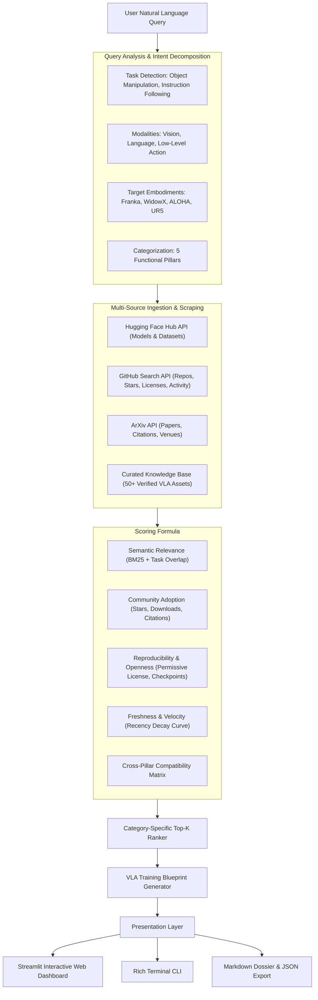

# 🤖 Intelligent Search & Ranking Engine for VLM & Robotics AI (VLA)

[](https://www.python.org/)
[](https://opensource.org/licenses/MIT)
[]()
[](https://streamlit.io/)
[](https://docs.pydantic.dev/)

An autonomous, multi-source discovery, evaluation, and ranking engine designed to identify, benchmark, and synthesize the best open-source assets for training **Vision-Language Models (VLMs)** and **Vision-Language-Action (VLA)** robotics policies.

Developed specifically to answer complex multi-faceted robotics AI queries such as:
> *"Find the best open-source datasets, VLM architectures, robotics datasets, simulation environments, and training frameworks for developing a vision-language-action model for a robot capable of object manipulation and natural-language instruction following."*

---

## 📑 Table of Contents
- [Executive Overview](#-executive-overview)
- [System Architecture](#-system-architecture)
- [The 5 Core Pillars](#-the-5-core-pillars)
- [Multi-Dimensional Scoring Model](#-multi-dimensional-scoring-model)
- [Installation & Setup](#-installation--setup)
- [Usage Modes](#-usage-modes)
  - [1. Rich Terminal CLI](#1-rich-terminal-cli)
  - [2. Interactive Streamlit Web UI](#2-interactive-streamlit-web-ui)
  - [3. Programmatic Python SDK](#3-programmatic-python-sdk)
- [Benchmark Results for Evaluation Query](#-benchmark-results-for-evaluation-query)
- [Synthesized VLA Training Blueprint](#-synthesized-vla-training-blueprint)
- [Project Directory Structure](#-project-directory-structure)
- [Testing & Quality Assurance](#-testing--quality-assurance)

---

## 🚀 Executive Overview

Developing generalist robot policies that translate visual observations and natural-language instructions into continuous low-level robot actions (e.g. 6-DoF end-effector trajectories, joint angles, gripper actuation) is difficult due to ecosystem fragmentation:
1. **Multi-Source Dispersion:** Pre-trained vision backbones live on Hugging Face Hub, imitation learning libraries reside across GitHub, empirical real-to-sim benchmarks are distributed across ArXiv, and robot demonstrations exist across diverse formats (RLDS, Zarr, HDF5).
2. **Compatibility Bottlenecks:** A dataset in RLDS format may require custom conversion to work with diffusion policies in PyTorch; a simulator like Isaac Lab may not natively correlate with real-world WidowX test cells.
3. **Reproducibility Gaps:** High GitHub stars do not guarantee that pre-trained weights are downloadable, that licenses permit commercial fine-tuning, or that environments can be run without proprietary dependencies.

**This engine solves these challenges** by integrating multi-source discovery, domain-specific intent parsing, multi-factor mathematical scoring, cross-pillar compatibility validation, and automated blueprint synthesis.

---

## 🏛 System Architecture



---

## 🧩 The 5 Core Pillars

The engine organizes and benchmarks resources into 5 essential architectural tiers:

| Pillar | Focus | Top Ranked Candidates |
| :--- | :--- | :--- |
| **1. VLM Foundation Architectures** | Visual grounding, patch tokenization, spatial reasoning | **Qwen2-VL**, **Prismatic VLMs**, **PaliGemma 2** |
| **2. VLA Policies & Action Heads** | Action chunking, continuous flow matching, auto-regressive control | **OpenVLA (7B)**, **Octo**, **π0**, **ACT** |
| **3. Robotics Manipulation Datasets** | Multi-embodiment demonstrations, teleoperation, RLDS/Zarr | **Open X-Embodiment (OXE)**, **ALOHA**, **DROID**, **Bridge V2** |
| **4. Simulation & Sim-to-Real** | High-throughput GPU physics, sim-to-real correlation | **ManiSkill 3**, **RoboCasa**, **SIMPLER**, **Isaac Lab** |
| **5. Training Frameworks & Toolkits** | Distributed fine-tuning, LoRA, FSDP, hardware integration | **LeRobot (Hugging Face)**, **OpenVLA Codebase**, **Robomimic** |

---

## 📐 Multi-Dimensional Scoring Model

Each resource $r$ is evaluated against query $q$ using a normalized composite score $S(r, q) \in [0, 100]$:

$$\text{Score}(r, q) = 100 \times \sum_{i \in \{\text{rel}, \text{adopt}, \text{repro}, \text{fresh}, \text{compat}\}} w_i \cdot S_i(r, q)$$

where weights satisfy $\sum w_i = 1.0$.

### 1. Semantic Relevance ($S_{\text{rel}} \in [0, 1]$)
Evaluates token-level overlap and ontology distance across target manipulation tasks (*pick-and-place*, *drawer opening*, *instruction following*), sensory modalities (*RGB*, *wrist camera*, *proprioception*), and robot embodiments (*Franka*, *WidowX*, *ALOHA*).

### 2. Community Adoption ($S_{\text{adopt}} \in [0, 1]$)
Sublinear log-normalized scaling of real-world traction:
$$S_{\text{adopt}} = 0.45 \frac{\ln(1 + \text{stars})}{\ln(1 + \text{stars}_{\max})} + 0.35 \frac{\ln(1 + \text{downloads})}{\ln(1 + \text{downloads}_{\max})} + 0.20 \frac{\ln(1 + \text{citations})}{\ln(1 + \text{citations}_{\max})}$$

### 3. Reproducibility & Openness ($S_{\text{repro}} \in [0, 1]$)
- **Permissive Open-Source License:** Apache-2.0 / MIT / BSD (+35 pts) vs Non-Commercial (+20 pts).
- **Pre-Trained Weights Available:** Verified downloadable checkpoints (+30 pts).
- **Simulation / Benchmark Integration:** Direct harness for sim-to-real evaluation (+20 pts).
- **Hardware Sizing Specification:** Detailed VRAM and compute documentation (+15 pts).

### 4. Freshness & Velocity ($S_{\text{fresh}} \in [0, 1]$)
Exponential decay function prioritizing state-of-the-art advances:
$$S_{\text{fresh}} = 100 \cdot \exp\left(-\frac{\ln(2)}{24} \cdot \Delta t_{\text{months}}\right)$$

### 5. Cross-Pillar Compatibility ($S_{\text{compat}} \in [0, 1]$)
Quantifies whether components seamlessly interoperate (e.g. OpenVLA pretrained weights + Open X-Embodiment RLDS datasets + LeRobot training framework + ManiSkill 3 / SIMPLER simulation).

---

## ⚡ Installation & Setup

### Prerequisites
- Python 3.9, 3.10, or 3.11

### 1. Clone the Repository
```bash
git clone https://github.com/Meghana/vla-resource-discovery-engine.git
cd vla-resource-discovery-engine
```

### 2. Install Dependencies
```bash
pip install -r requirements.txt
```

### 3. Optional Environment Configuration
The engine works **100% out-of-the-box offline and unauthenticated**. If you wish to enable higher rate limits on live GitHub and Hugging Face queries, create a `.env` file:
```bash
cp .env.example .env
# Add your HF_TOKEN and GITHUB_TOKEN
```

---

## 🖥 Usage Modes

### 1. Rich Terminal CLI

Run the full pipeline directly in your terminal with colored tables and synthesis:
```bash
# Run with the prompt query and export to markdown
python -m vla_engine.cli --query "Find the best open-source datasets, VLM architectures, robotics datasets, simulation environments, and training frameworks for developing a vision-language-action model for a robot capable of object manipulation and natural-language instruction following." --export markdown --output sample_evaluation_report.md
```

**CLI Flags:**
- `--query`, `-q`: Natural language search query.
- `--no-live`: Disable live network APIs and run purely from verified offline knowledge base.
- `--export`, `-e`: Export format (`markdown`, `json`).
- `--output`, `-o`: Custom export path.
- `--weight-relevance`, `--weight-adoption`, etc.: Custom weight adjustments.

---

### 2. Interactive Streamlit Web UI

Launch the interactive dashboard with radar comparison charts, weight tuning sliders, and one-click blueprint export:
```bash
streamlit run vla_engine/ui/app.py
```
Open `http://localhost:8501` in your browser.

**Features:**
- Real-time weight adjustment sliders.
- Query preset dropdowns for rapid evaluation.
- Detailed score breakdown dataframes across all 5 pillars.
- Downloadable Markdown dossiers and JSON execution artifacts.

---

### 3. Programmatic Python SDK

Integrate the engine into your own pipelines:
```python
from vla_engine.parser.query_parser import QueryParser
from vla_engine.discovery.aggregator import DiscoveryAggregator
from vla_engine.evaluation.ranker import ResourceRanker
from vla_engine.synthesis.blueprint_generator import BlueprintGenerator
from vla_engine.synthesis.formatter import ReportFormatter

# 1. Parse natural language intent
parser = QueryParser()
query = parser.parse("Find best VLA policy and simulation environment for object manipulation")

# 2. Discover resources across Hugging Face, GitHub, ArXiv, and Curated KB
aggregator = DiscoveryAggregator(use_live_apis=True)
resources = aggregator.discover_all(query)

# 3. Score and rank candidates
ranker = ResourceRanker()
ranked_categories = ranker.rank_resources(resources, query, top_k_per_category=5)

# 4. Synthesize end-to-end training blueprint
generator = BlueprintGenerator()
blueprint = generator.generate(ranked_categories, query)

# 5. Export Markdown report
report_markdown = ReportFormatter.to_markdown(blueprint)
print(report_markdown)
```

---

## 🏆 Benchmark Results for Evaluation Query

Below is the executive summary generated by the engine for the evaluation prompt:

| Pillar | #1 Recommended Resource | Org / Authors | License | Composite Score | Key Advantage |
| :--- | :--- | :--- | :---: | :---: | :--- |
| **VLM Foundation Architecture** | **Qwen2-VL (2B, 7B, 72B)** | Alibaba Cloud | `Apache-2.0` | **85.7** | Dynamic resolution NaViT tokens, video support, superior spatial grounding |
| **VLA Policy & Action Head** | **OpenVLA (7B)** | Stanford & UC Berkeley | `MIT` | **92.1** | Outperforms RT-2-X (55B) by 16.5% while being 7x smaller; LoRA fine-tuning ready |
| **Robotics Manipulation Dataset**| **Open X-Embodiment (OXE)** | OXE Collaboration | `CC-BY-4.0` | **74.7** | 1M+ real robot trajectories across 22 embodiments in standardized RLDS format |
| **Simulation & Sim-to-Real** | **ManiSkill 3** | UC San Diego | `Apache-2.0` | **85.0** | 30,000+ FPS GPU-parallel physics, articulated object manipulation, sim-to-real tools |
| **Training Framework & Toolkit**| **LeRobot** | Hugging Face | `Apache-2.0` | **73.2** | Standardized PyTorch models, Hub integration, pretrained weights, and hardware guides |

**Ecosystem Compatibility Score:** `89.0 / 100` (*Highly Compatible Synergistic Stack*).

---

## 🗺 Synthesized VLA Training Blueprint

The engine outputs a 4-step deployment recipe:

```
┌────────────────────────────────────────────────────────────────────────────────────────┐
│                          END-TO-END VLA TRAINING ROADMAP                                │
├────────────────────────────────────────────────────────────────────────────────────────┤
│ Step 1: Vision-Language Initialization & Spatial Grounding                             │
│ • Tool: Qwen2-VL / Prismatic VLMs                                                      │
│ • Input: High-resolution RGB streams + Natural language prompt embeddings              │
│ • Action: Extract spatial patch tokens and project visual features into LLM space.     │
│ • Hardware: 1x NVIDIA RTX 4090 or A100 (>= 24GB VRAM)                                  │
├────────────────────────────────────────────────────────────────────────────────────────┤
│ Step 2: Demonstration Ingestion & Policy Co-Fine-Tuning                                │
│ • Tools: OpenVLA (7B) + Open X-Embodiment Dataset + LeRobot                            │
│ • Input: Multi-view robot trajectories (RGB + Proprioception) conditioned on tasks     │
│ • Action: Parameter-Efficient Fine-Tuning (LoRA / FSDP) on Cartesian delta EEF actions │
│ • Hardware: 1x RTX 4090 (LoRA) or 8x A100/H100 (Full fine-tuning)                     │
├────────────────────────────────────────────────────────────────────────────────────────┤
│ Step 3: Simulation Benchmarking & Domain Randomization                                 │
│ • Tools: ManiSkill 3 / SIMPLER Benchmark                                               │
│ • Input: Policy checkpoint weights + Articulated task environments                     │
│ • Action: High-throughput GPU rollout, zero-shot instruction following evaluation      │
│ • Hardware: 1x NVIDIA GPU with Vulkan / PhysX 5 support                                │
├────────────────────────────────────────────────────────────────────────────────────────┤
│ Step 4: Physical Hardware Rollout & Edge Inference                                     │
│ • Tools: LeRobot hardware drivers + TensorRT-LLM / ONNX                                │
│ • Input: Real-time 30 FPS camera feed + Voice/Text instructions                        │
│ • Action: 10Hz-50Hz closed-loop control with safety torque filters                     │
│ • Hardware: NVIDIA Jetson AGX Orin (64GB) or local RTX 4070 workstation                │
└────────────────────────────────────────────────────────────────────────────────────────┘
```

---

## 📁 Project Directory Structure

```
vla-resource-discovery-engine/
├── README.md                      # Comprehensive technical documentation & benchmarks
├── LICENSE                        # MIT License
├── requirements.txt               # Production dependencies
├── pyproject.toml                 # Modern package configuration
├── .gitignore                     # Git hygiene rules
├── .env.example                   # API token template
│
├── data/
│   ├── seed_knowledge_base.json   # 50+ validated, expert-curated VLA resources
│   └── cache/                     # Disk cache for live API responses
│
├── vla_engine/
│   ├── __init__.py
│   ├── cli.py                     # Rich terminal CLI application
│   ├── models/
│   │   ├── __init__.py
│   │   ├── resource.py            # Resource, Category, ScoreBreakdown models
│   │   ├── query.py               # ParsedQuery and ScoringWeights models
│   │   └── blueprint.py           # VLABlueprint & PipelineStep models
│   ├── parser/
│   │   ├── __init__.py
│   │   ├── query_parser.py        # Natural language intent decomposer
│   │   └── taxonomy.py            # VLA task, modality, and embodiment ontology
│   ├── discovery/
│   │   ├── __init__.py
│   │   ├── base.py                # Abstract provider & disk caching engine
│   │   ├── curated_provider.py    # Curated knowledge base provider
│   │   ├── hf_provider.py         # Live Hugging Face Hub scraper
│   │   ├── github_provider.py     # Live GitHub repository scraper
│   │   ├── arxiv_provider.py      # Live ArXiv paper searcher
│   │   └── aggregator.py          # Parallel multi-provider orchestrator
│   ├── evaluation/
│   │   ├── __init__.py
│   │   ├── scoring.py             # Multi-dimensional mathematical scoring
│   │   ├── compatibility.py       # Cross-pillar compatibility matrix
│   │   └── ranker.py              # Category-wise sorting & leaderboard ranker
│   ├── synthesis/
│   │   ├── __init__.py
│   │   ├── blueprint_generator.py # 4-step VLA training blueprint synthesizer
│   │   └── formatter.py           # Markdown & JSON report generator
│   └── ui/
│       ├── __init__.py
│       └── app.py                 # Interactive Streamlit web application
│
├── tests/
│   ├── __init__.py
│   ├── test_parser.py             # Query intent extraction tests
│   ├── test_scoring.py            # Mathematical scoring tests
│   ├── test_compatibility.py      # Compatibility matrix tests
│   ├── test_discovery.py          # Provider loading & deduplication tests
│   └── test_blueprint.py          # Blueprint generation & export tests
│
└── examples/
    ├── run_query.py               # One-click execution demo script
    └── sample_evaluation_report.md# Pre-generated comprehensive report for prompt query
```

---

## 🧪 Testing & Quality Assurance

The project includes an automated test suite covering all functional modules.

Run the test suite:
```bash
pytest tests/ -v
```

**Test Coverage:**
- `test_parser.py`: Tests intent extraction, task identification, modality parsing, and weight normalization.
- `test_scoring.py`: Tests mathematical bounds ($S \in [0, 100]$), log scaling, and license permissiveness boosting.
- `test_compatibility.py`: Verifies architectural synergy calculations across components.
- `test_discovery.py`: Tests curated database loading and entity deduplication.
- `test_blueprint.py`: Verifies end-to-end pipeline synthesis and serialization to Markdown/JSON.

---

## 🤝 Contributing & License
Contributions are welcome! Please submit an issue or pull request.
Released under the [MIT License](LICENSE).
